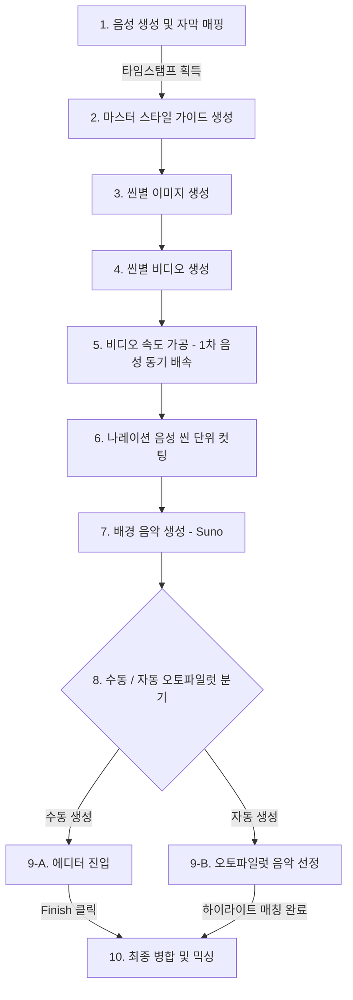

# 장면(Scene) 단위 마이크로 파이프라인 및 에디터 개편 계획서 (최종안)

> [!IMPORTANT]
> 본 계획서는 에디터 진입 전 비디오 병합을 제거하고, 대신 나레이션 음성을 씬 타임스탬프 기준으로 슬라이싱하여 에디터 효율을 극대화하는 설계안입니다. 추가적으로 **음성 배속 곱연산 인코딩** 및 **대사 공백(무음) 시간 처리** 로직을 포함하고 있습니다.

---

## 1. 개편 후 전체 아키텍처 흐름

---

## 2. 핵심 설계 기믹 (Core Mechanism)

### 💡 기믹 1: [배속 조절] 1차 FFmpeg 가공 ➡️ 2차 브라우저 가상 배속 ➡️ 곱연산 단 1회 렌더링
이중 인코딩으로 인한 화질 저하를 방지하면서도 에디터 열자마자 완벽히 싱크가 맞물린 화면을 띄워주기 위해 곱연산 배속 기법을 채택합니다.

* **디폴트 상태 (1차 조절)**:
  * 비디오 생성 완료 후, 기존 [process/speed/route.ts](file:///home/jaeho/Projects/short_real/app/api/video/process/speed/route.ts)를 통해 나레이션 길이에 딱 맞춘 1차 가공본 `${taskId}/${requestId}.mp4`를 만들어 둡니다.
  * 유저가 에디터를 켜자마자 음성과 영상이 1:1로 자로 잰 듯 정확히 매칭된 상태로 열립니다.
* **에디터 조작 (2차 조절)**:
  * 유저가 씬 길이를 늘이거나 줄이면, 에디터 브라우저는 실시간 가상 배속(`videoElement.playbackRate`)을 걸어 렉 없이 화면을 즉시 갱신해 보여줍니다.
  * 나레이션 음성도 같은 배속으로 재생하여 립싱크를 유지합니다.
* **최종 결합 (곱연산 인코딩)**:
  * 최종 Finish 시점에는 1차 가공본이 아닌 **최초의 Fal.ai 순정 원본 비디오(4.0초)**를 가져와서 `[1차 배속 수치] × [2차 가속/감속 비율]`을 곱연산한 **최종 배율**로 **단 딱 한 번만 FFmpeg 인코딩**을 거쳐 합칩니다. 화질 저하가 원천 차단됩니다.

---

### 💡 기믹 2: [공백 처리] 비디오 영역 연장 ➡️ 개별 오디오 대기 ➡️ 통짜 결합
씬 사이의 대사가 없는 침묵 구간(Silent Gap)에 대해 오디오 싱크가 어긋나는 것을 방지합니다.

* **비디오**:
  * 씬의 종료 시간 기준을 다음 대사가 시작하는 직전 시점(`nextScene.startSec`)으로 잡아 비디오의 재생 길이를 연장시킵니다. 즉, 대사가 끝나도 이전 장면 비디오가 공백 화면을 부드럽게 메워줍니다.
* **에디터 플레이어**:
  * 잘라진 씬 나레이션 오디오(`scene_${sceneNumber}_voice.mp3`)는 대사 완료 시점에 바로 정지하여 대기 상태(무음)로 진입합니다. 비디오가 씬 종료 시점에 다다르면 다음 씬 비디오와 오디오로 스위칭합니다.
* **최종 렌더링**:
  * 최종 결합 시에는 쪼개진 오디오가 아닌, 이미 자연스러운 무음이 섞여 있는 **원본 통짜 나레이션 오디오 파일(`{taskId}.mp3`)**을 그대로 얹어서 믹싱하므로 인코딩 완성본의 싱크 퀄리티가 무결하게 지켜집니다.

---

## 3. 수정 대상 파일 및 세부 작업 계획

### 🛠️ 1단계: 나레이션 오디오 씬 단위 슬라이싱
* **대상 파일**: [voiceServerAPI.ts](file:///home/jaeho/Projects/short_real/lib/api/server/voiceServerAPI.ts)
* **작업 내용**:
  * FFmpeg 무손실 컷팅(`-c copy`)을 사용하여 음질 손상 없이 소수점 초 단위로 칼같이 쪼갠 오디오 `${taskId}/scene_${sceneNumber}_voice.mp3`를 추출해 업로드하는 메소드 `sliceVoiceToScenes` 구현.
* **호출 시점**: 
  * [video-metadata/route.ts](file:///home/jaeho/Projects/short_real/app/api/autopilot/video-metadata/route.ts#L313)의 음성 파일 저장 성공 직후 연동.

### 🛠️ 2단계: 백엔드 파이프라인 흐름 재정렬 (1차 병합 우회)
* **대상 파일**: [route.ts (api/video/process/speed)](file:///home/jaeho/Projects/short_real/app/api/video/process/speed/route.ts#L177-L194)
* **작업 내용**:
  * 모든 비디오 속도 조절 완료 시 병합 엔드포인트 `/api/video/merge`를 호출하던 부분을 완전히 생략하고, 바로 `COMPOSING_MUSIC` 상태로 이전한 뒤 음악 생성 API(`/api/music`)를 호출하도록 수정.

### 🛠️ 3단계: 에디터용 개별 씬 URL 획득 API 신설
* **대상 파일**: `/app/api/video/url/scenes/route.ts` (신설)
* **작업 내용**:
  * 해당 `taskId`의 씬별 가공 비디오 파일(`requestId.mp4`)들과 1단계에서 잘라둔 씬별 나레이션 파일들의 Signed URL 리스트를 모아 배열 형태의 JSON으로 반환하는 엔드포인트 구축.

### 🛠️ 4단계: 에디터 프론트엔드 플레이어 씬 연동 및 프리로드
* **대상 파일**: 
  * [WorkspaceEditorPageClient.tsx](file:///home/jaeho/Projects/short_real/components/page/workspace/editor/WorkspaceEditorPageClient.tsx)
  * [VideoPlayerPanel.tsx](file:///home/jaeho/Projects/short_real/components/page/workspace/editor/VideoPlayerPanel.tsx)
* **작업 내용**:
  * **듀얼 비디오 태그 스위칭 (Double Buffer)** 적용: 화면에 `<video>` 객체 2개를 교차 배치하여 프리로드 연동으로 끊김 없는 장면 스위칭 재생.
  * **오디오 바인딩**: 씬별 잘라둔 오디오(`scene_${sceneNumber}_voice.mp3`)를 비디오 재생 속도 및 타이밍에 결합하여 연동 재생.
  * **실시간 가상 속도 조절**: 타임라인 드래그 속도 조절 시 브라우저 내 HTML5 객체의 `playbackRate`를 동적으로 변경.

### 🛠️ 5단계: 최종 인코딩 단계에서 1차 병합 선행 실행
* **대상 파일**: [route.ts (api/video/merge/final)](file:///home/jaeho/Projects/short_real/app/api/video/merge/final/route.ts)
* **작업 내용**:
  * 최종 결합(`merge/final`)의 자막/음악 믹싱 예측 태스크 시작 바로 전 단계에서 `videoServerAPI.postFinalVideo`를 선행적으로 실행하도록 변경.
  * 유저가 조절한 2차 배속 수치(곱연산 적용)가 FFmpeg setpts 명령어로 인코딩되도록 수식을 정비하여 최종 완성본 생성.
