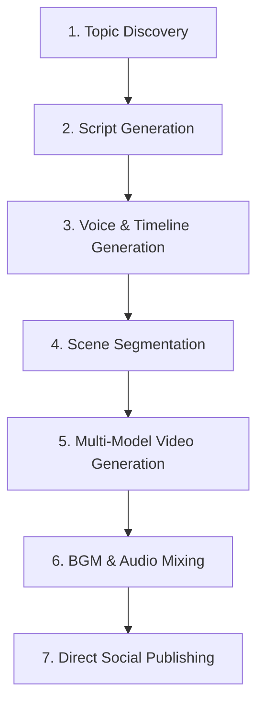

# ShortReal AI - Product Brief & Marketing Context

This document is prepared to serve as a comprehensive context prompt for **Perplexity AI** or other LLMs to derive marketing strategies, positioning, and copywriting for **ShortReal AI**.

---

## 1. Product Overview (What is ShortReal AI?)

*   **Tagline**: Harnessed AI Video Studio (Automated Shorts/Reels/TikTok Factory)
*   **Target Website URL**: `https://shortreal.ai`
*   **Value Proposition**: We handle the complex video generation pipeline. Users simply define their niche or script, select their preferred AI models, and let the engine automate the entire production and daily publishing process.
*   **Key Philosophy**: **Not a Wrapper, but an Engine.** It handles physics, framing, camera moves, and atmosphere to make AI-generated videos look cinematic and coherent rather than static or generic.

---

## 2. Core Features & Automation Pipeline

ShortReal AI stands out by automating the entire lifecycle of vertical short-form video creation via a robust background task orchestrator.



### ① Topic Discovery (AI-driven Ideation)
*   **How it works**: The engine automatically discovers non-overlapping topics based on the chosen category (Niche). 
*   **Idempotency & History**: Generates unique topics by storing historical discoveries (`topic_history`) to prevent duplicate content.

### ② Script Generation
*   Writes highly engaging 30-second scripts matching the tone, style guidelines, and negative constraints of the chosen Niche.

### ③ Voiceovers & Timeline Mapping (Powered by ElevenLabs)
*   Generates realistic voice acting.
*   Extracts precise word-level timeline data (Subtitle segments) for visual synchronization.
*   **Duration Scaling**: If the voice output exceeds 32 seconds, the engine dynamically compresses the speed (up to 1.15x speed) using an audio scaling algorithm to fit within the 30-second short-form duration limit.

### ④ Scene Segmentation & Caption Styling
*   Splits the script into visual scenes and maps subtitle words to corresponding frames.
*   Auto-positions captions based on height, font size, active/inactive word colors, and outline thicknesses.

### ⑤ Image & Video Generation (Multi-Model Pipeline)
*   Executes sequential generation: **Text-to-Image (T2I) $\rightarrow$ Image-to-Image (I2I) $\rightarrow$ Image-to-Video (I2V)**.
*   Handles aspect ratio constraints (9:16 vertical and 16:9 horizontal).

### ⑥ Background Music & Mixing
*   Integrates AI-generated background music, trims to length, adjusts volume, and mixes it with the voice track.

### ⑦ Direct Social Publishing (Autopilot)
*   Triggered by **Trigger.dev** background tasks 2 hours before the scheduled time.
*   Automatically posts the completed video directly to connected social platform accounts (YouTube Shorts, TikTok, Instagram Reels).

---

## 3. Built-in Niches (Target Audience Segments)

ShortReal AI comes with 7 specialized presets designed for viral short-form categories:

1.  **Historical Secrets (🏛️)**: Suspenseful, mysterious narratives focusing on 18th/19th-century historical human drama.
2.  **Scary Stories (👻)**: Psychological horror and urban legends with visceral twists.
3.  **Daily Motivation (💪)**: High-energy, intense, and actionable reality checks based on real-world human triumph.
4.  **Business Legends (💰)**: Smart business strategies and wealth-building history focusing on genius decision-making.
5.  **Life Philosophy (🧠)**: Thought-provoking Stoic principles or philosophical paradoxes applied to daily life.
6.  **Dark Psychology (👁️)**: Body language analysis and behavioral observation of social manipulation.
7.  **True Crime (🕵️)**: Cold cases, masterminds, and intellectual heist breakdowns.

---

## 4. Business Model (BM) & Pricing Policies

ShortReal AI employs a unique **"Bring Your Own Key" (BYOK)** billing system combined with a subscription model. This eliminates the massive markups found in traditional AI video creation tools.

### ① Bring Your Own Key (BYOK) - The "Raw Cost" Advantage
*   Users connect their own provider API keys (currently supporting **fal.ai**).
*   **Zero Platform Markup**: Users pay only the direct cost charged by fal.ai.
*   Costs are calculated based on raw consumption:
    *   **T2I (Character)**: Cost per character generation.
    *   **I2I (Scene)**: Cost per scene generation.
    *   **I2V (Video)**: Cost per second of generation.
    *   **Input Image Pricing**: Captures extra charges for models requiring input reference images (either from the first image (`input_image`) or starting from the 2nd image (`input_image_above_1`)).
*   *Example*: Users can select Grok Imagine, Hidream, Seedream, or Ideogram, paying exactly the wholesale rate (e.g., $0.05 per 1K output image or $0.0045 per additional input image).

### ② Subscription Plans (Platform Access Fee)
Paid subscriptions scale based on the number of automated series a user wants to run simultaneously.

*   **Plan 1 (Starter) - $19 / month**
    *   1 Autopilot Series (1 automated active publishing schedule)
    *   Commercial license, ElevenLabs voiceovers, AI BGM, auto captions, direct upload, no watermark.
*   **Plan 2 (Growth) - $29 / month**
    *   2 Autopilot Series
    *   All features included.
*   **Plan 4 (Pro) - $49 / month**
    *   Unlimited Autopilot Series
    *   All features included.

---

## 5. Technical Stack

*   **Frontend & Core**: React, Next.js 15+ (App Router), TypeScript, Tailwind CSS
*   **Database & Auth**: Supabase (PostgreSQL, Realtime, Storage)
*   **Task Scheduling & Orchestration**: Trigger.dev v3 (Serverless background execution)
*   **Payment Infrastructure**: Polar.sh
*   **Integrations**: ElevenLabs API, fal.ai API (hosting Grok, Kling, Seedream, Luma, etc.)

---

## 6. Marketing Prompts for Perplexity AI

*Copy and paste the prompt below into Perplexity to brainstorm marketing strategies.*

```text
Act as a growth marketing strategist for SaaS. 

We have launched ShortReal AI (https://shortreal.ai), a Next.js-based AI video generation studio that automates short-form video creation (Shorts, Reels, TikTok) from idea generation to social media upload.

Our unique selling propositions (USPs) are:
1. Bring Your Own Key (BYOK): We do not markup AI model generation costs. Users connect their fal.ai API key and pay only the exact wholesale cost of Grok, Luma, Kling, etc.
2. Complete Automation (Autopilot): Trigger.dev coordinates the entire cron-like scheduling. Users select a niche (e.g., Dark Psychology, Historical Secrets) and schedule publishing, and the engine automatically generates and uploads videos daily.
3. High Production Value: The engine applies professional cinematography rules (camera weight, dynamic framing, weather atmospheres, audio ducking, ElevenLabs voice scaling).

Our subscription pricing is:
- $19/mo: 1 Autopilot Series
- $29/mo: 2 Autopilot Series
- $49/mo: Unlimited Autopilot Series

Based on these facts:
1. Identify the ideal customer personas (ICPs) who would gain the most financial value from this BYOK setup compared to high-markup platforms like InVideo or OpusClip.
2. Outline a GTM (Go-To-Market) strategy targeting faceless channel creators on YouTube and TikTok.
3. Write 3 high-converting ad copy angles emphasizing the "No platform markup (BYOK)" benefit.
4. Suggest organic viral content ideas we can post using our own engine to demonstrate product value.
```
